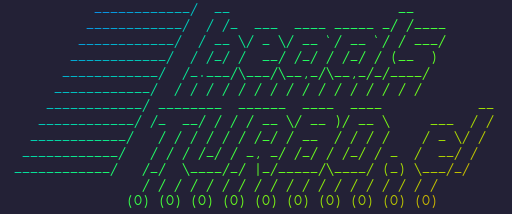

beads-turbo.el - Fast Emacs Client for Beads
===================================================================



## Overview

`beads-turbo.el` is an actively developed fork of [ctietze/beads.el](https://codeberg.org/ctietze/beads.el) that supports the latest [Beads](https://github.com/gastownhall/beads) issue tracking system and its Dolt-backed task graph. `beads-turbo.el` provides a fast Emacs interface to Beads the dolt-backed issue tracker that stores data locally in `.beads/dolt` alongside your code and also supports git-backed `dolt` remotes on DoltHub and Git forges like Github and Codeberg (but not Bitbucket). It works well with AI coding assistants but doesn't require them—you can use it entirely from Emacs or the command line.

The fork keeps the concise `beads-*` Emacs command and symbol namespace for continuity, while using the `beads-turbo.el` project name to distinguish this maintained version from the original project which does not support dolt DB backend.

This fork is renamed *-turbo* because it does not shell out to `bd` CLI for read operations, but instead uses `mysql.el` native mysql wire protocol written in Elisp by Lucius Chen to query the Dolt DB for beads issues. The speed-up over synchronous sub-process calls to `bd` is considerable. In my benchmark tests, using `mysql.el` is more than 50x times faster than calling `bd list` in a sub-process.

## Screenshots

TODO

### Issue List

M-x beads-org-list


### Issue Details

From the list view, press *ENTER* on any org-header to see full issue details including all the newer fields included in recent beads versions 1.0+


### Editing

Edit long-form fields (description, design, notes) in dedicated buffers with `markdown-mode` support:


## Installation

### use-package

```elisp
(use-package beads
  :straight nil
  :load-path ("/path/to/beads-turbo.el/lisp"
              "/path/to/beads-turbo.el/vendor/vui.el"))
```

### MELPA

TODO


### Manual Installation

```elisp
(add-to-list 'load-path "/path/to/beads-turbo.el/lisp")
(require 'beads)
```

> **Note:** When cloning the repository, make sure to also pull the vendored `vui.el` submodule under `vendor/vui.el`. Either clone with `git clone --recurse-submodules <url>`, or, if you've already cloned, run `git submodule update --init --recursive` from the repo root.  A leading `-` in `git submodule status` indicates the submodule has not been initialized yet.

### With straight.el

Using `straight-use-package` directly:

```elisp
(straight-use-package
 '(beads
   :type git
   :host github
   :repo "gojun077/beads-turbo.el"
   :files ("lisp/*.el"
           "vendor/vui.el/*.el"
           "vendor/mysql.el/mysql.el")
   :includes (vui mysql)))
```

Or with `use-package` managed by straight.el:

```elisp
(straight-use-package 'use-package)

(use-package beads
  :straight '(beads
              :type git
              :host github
              :repo "gojun077/beads-turbo.el"
              :files ("lisp/*.el"
                      "vendor/vui.el/*.el"
                      "vendor/mysql.el/mysql.el")
              :includes (vui mysql)))
```

## Usage

- `M-x beads` or `M-x beads-org-list` - Open the issue list (org-mode default)
- `M-x beads-about` - Show Beads Turbo version/source diagnostics and project ASCII art

## Keybindings

### List Mode (`beads-list-mode`)

| Key | Command | Description |
|-----|---------|-------------|
| `RET` | `beads-list-goto-issue` | Open issue in detail view |
| `/` | `beads-search` | Search issues by title/description |
| `f` | `beads-filter-menu` | Open filter menu |
| `f s` | `beads-filter-status` | Filter by status |
| `f p` | `beads-filter-priority` | Filter by priority |
| `f t` | `beads-filter-type` | Filter by type |
| `f a` | `beads-filter-assignee` | Filter by assignee |
| `f l` | `beads-filter-label` | Filter by label |
| `f r` | `beads-filter-ready-issues` | Show ready issues only |
| `f b` | `beads-filter-blocked-issues` | Show blocked issues only |
| `f c` | `beads-filter-clear` | Clear all filters |
| `s` | `beads-list-toggle-sort-mode` | Toggle sectioned/column sort |
| `o` | `beads-list-cycle-sort` | Cycle through sort columns |
| `O` | `beads-list-reverse-sort` | Reverse sort direction |
| `S` | `beads-stats` | Show project statistics |
| `D` | `beads-delete-issue` | Delete issue (with confirmation) |
| `R` | `beads-reopen-issue` | Reopen closed issue |
| `g` | `beads-list-refresh` | Refresh issue list |
| `?` | `beads-menu` | Show transient menu |
| `q` | `beads-list-quit` | Quit |

### Detail Mode (`beads-detail-mode`)

| Key | Command | Description |
|-----|---------|-------------|
| `D` | `beads-delete-issue` | Delete issue (with confirmation) |
| `R` | `beads-reopen-issue` | Reopen closed issue |
| `g` | `beads-detail-refresh` | Refresh detail view |
| `?` | `beads-menu` | Show transient menu |
| `q` | `quit-window` | Quit |

### Text Field Edit Buffers

Long text fields such as descriptions, design notes, acceptance criteria, and notes open a temporary editable buffer from the list or detail view.  This is a helper for those fields, not a separate issue editing workflow.

| Key | Command | Description |
|-----|---------|-------------|
| `C-c C-c` | `beads-edit-commit` | Save changes |
| `C-c C-k` | `beads-edit-abort` | Discard changes |


### Stale Issues (`beads-stale-mode`)

Shows issues not updated within a configurable number of days.

| Key | Command | Description |
|-----|---------|-------------|
| `RET` | `beads-stale-goto-issue` | Open issue in detail view |
| `c` | `beads-stale-claim` | Claim issue (set to in_progress) |
| `d` | `beads-stale-set-days` | Change days threshold |
| `f` | `beads-stale-set-filter` | Filter by status |
| `g` | `beads-stale-refresh` | Refresh list |
| `q` | `quit-window` | Quit |

### Orphaned Issues (`beads-orphans-mode`)


Shows issues referenced in git commits but not marked as closed.

| Key | Command | Description |
|-----|---------|-------------|
| `RET` | `beads-orphans-goto-issue` | Open issue in detail view |
| `c` | `beads-orphans-close` | Close orphan with reason |
| `g` | `beads-orphans-refresh` | Refresh list |
| `q` | `quit-window` | Quit |


## Customization


### Refreshing the List

The list view refreshes automatically when:

- A write happens through any beads command (transient menu, edit commands, detail-mode actions, forms).
- You return to a `beads-list-mode` window from another buffer (e.g.  closing a detail view).
  - This event-driven refresh uses an async, cursor-preserving fetch that short-circuits via the cache freshness token when nothing has changed, so it is essentially free in the common case.

Press `g` in the list buffer for a manual refresh — useful when an external `bd` invocation or another Emacs session has mutated the DB and you want to pick up the change without leaving and re-entering the buffer.


### Stale Issues (`beads-stale`)

```elisp
;; Change staleness threshold (default: 30 days)
(setq beads-stale-days 14)

;; Default to showing only in_progress issues
(setq beads-stale-status "in_progress")
```

| Variable | Default | Description |
|----------|---------|-------------|
| `beads-stale-days` | `30` | Days without update before issue is stale |
| `beads-stale-status` | `nil` | Filter by status (nil = all statuses) |

### Issue Type Display (`beads-faces`)

```elisp
;; Use 4-character abbreviations (feat, task, epic, chor, conv, agnt)
(setq beads-type-style 'short)

;; Show glyphs for special types (gate ■, convoy ▶, agent ◉, role ●, rig ⚙)
(setq beads-type-glyph t)
```

| Variable | Default | Description |
|----------|---------|-------------|
| `beads-type-style` | `'full` | `'full` for full names, `'short` for 4-char |
| `beads-type-glyph` | `nil` | Show unicode glyphs for special types |

### Detail View Rendering (`beads-detail`)

When `markdown-mode` is installed, the detail view renders descriptions, design notes, acceptance criteria, and comments with markdown syntax highlighting.

```elisp
;; Disable markdown rendering in detail view
(setq beads-detail-render-markdown nil)

;; Disable vui.el and use traditional text rendering
(setq beads-detail-use-vui nil)
```

| Variable | Default | Description |
|----------|---------|-------------|
| `beads-detail-render-markdown` | `t` | Enable markdown syntax highlighting |
| `beads-detail-use-vui` | `t` | Use vui.el declarative components |
| `beads-detail-vui-editable` | `t` | Show inline edit buttons in vui mode |
| `beads-detail-section-style` | `'heading` | `'heading` (compact) or `'separator` (with rules) |

## Requirements

- Emacs 30+
- [Beads](https://github.com/gastownhall/beads) CLI: `bd` 1.0.3+ (recommended)
- `transient` package (for menus)
- `vui` package (for declarative UI components)
- `markdown-mode` (optional, for editing long text fields)

### CLI Backends

`beads-turbo.el` supports the `bd` CLI backend.

- **`bd`** (default) — Full-featured.

### Direct Dolt SQL read path (optional)

`beads-backend-dolt-sql` is a read-path accelerator that sends `list`/`show`/`ready`/`stats`/`count`/`stale` queries directly to the local Dolt SQL server. [mysql.el](https://github.com/LuciusChen/mysql.el) package is vendored, so that `beads-turbo.el` can use its native Emacs Lisp MySQL wire-protocol client.  A fall-back is a long-lived `mysql`/`mariadb` client session as well as one-shot `mariadb -e`.  Writes always fall back to the `bd` CLI.

Toggle it from the menu: `M-x beads-menu` → `,` (Config…) → `d` (`[ ] Dolt SQL read path` / `[x] Dolt SQL read path`). The toggle calls `beads-backend-dolt-sql-activate` / `beads-backend-dolt-sql-deactivate` and respects the `beads-dolt-sql-enabled` custom variable.

## Development

This project uses [Beads](https://github.com/gastownhall/beads) itself for issue tracking.  You can check out the beads-turbo.el repository and view the project's issues:

```bash
# Launch Emacs with beads-turbo.el loaded
make interactive
```

Then run `M-x beads-org-list` to see the `beads-turbo.el` development issues.
